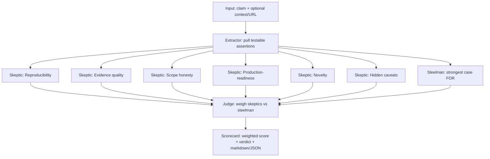

# ship-or-theater

Evaluate an AI claim, announcement, or demo against a fixed, weighted **reality rubric** and render an honest **scorecard**: a verdict (`SHIPS` / `MIXED` / `THEATER`), a 0–100 reality score, per-dimension scores, and the evidence on both sides — the strongest steelman and the strongest debunk.

The tool is built to model the behavior it judges: schema-validated structured output, adversarial verification, graceful degradation, and no fabricated confidence. When the evidence does not support a number, the tool says *inconclusive* rather than guessing one.

## The problem

AI announcements are easy to make and hard to verify. A polished demo, a single cherry-picked benchmark, or a rebranded wrapper can look identical to genuine, shipped capability. The reader is left to separate signal from theater by hand, claim by claim.

## The approach

A multi-agent adversarial pipeline scores the claim against six fixed dimensions. Each dimension gets a dedicated skeptic hunting for theater; a steelman argues the best honest case for the claim; a judge weighs both and assigns calibrated, per-dimension scores. The scorecard is the weighted mean of the dimensions that produced usable evidence — nothing more, nothing invented.



The six skeptics run in parallel and are fault-tolerant: if one fails, that dimension is marked `inconclusive` and excluded from the weighted mean — the run never crashes and never substitutes a guess.

## The rubric

The rubric is the tool's point of view: fixed, weighted, and transparent.

| # | Dimension | Weight | What it measures |
|---|-----------|--------|------------------|
| 1 | Reproducibility | 0.20 | Could an independent party reproduce it, or is it a cherry-picked demo? |
| 2 | Evidence quality | 0.20 | Real benchmarks and data vs. screenshots and vibes |
| 3 | Scope honesty | 0.20 | Does it generalize, or is narrow/overfit work dressed up as general? |
| 4 | Production-readiness | 0.15 | Demo vs. deployable (latency, cost, reliability, governance) |
| 5 | Novelty | 0.10 | Genuine new capability or a wrapper/rebrand? |
| 6 | Hidden caveats | 0.15 | What is NOT said (failure modes, constraints, cost) |

Each dimension is scored 0–100 (100 = real/credible, 0 = pure theater). The reality score is the weighted mean over the dimensions that produced usable evidence.

**Verdict bands:** `SHIPS` ≥ 70 · `MIXED` 40–69 · `THEATER` < 40. With no usable dimensions, the verdict is `INCONCLUSIVE` — the tool refuses to assert a verdict it cannot support.

## How scoring works

1. The **extractor** isolates the discrete, testable assertions from the raw claim.
2. Six **skeptics** — one per dimension — each look for theater and assign a severity.
3. The **steelman** argues the strongest *defensible* case for the claim, without inventing evidence.
4. The **judge** weighs skeptics against the steelman and assigns each dimension a score, a confidence, and reasoning — or marks it `inconclusive`.
5. The **scorecard** computes the weighted mean over the usable dimensions, renormalizing the weights so the result stays on a 0–100 scale, then maps it to a verdict band.

Inconclusive dimensions are dropped from the mean and the weights are renormalized across what remains. If every dimension is inconclusive, the overall score is `null` and the verdict is `INCONCLUSIVE`.

## Install

```bash
npm install -g ship-or-theater
# or run without installing:
npx ship-or-theater "<claim>" --context "<context>"
```

Requires Node ≥ 20 and one of two backends (see below).

## Two ways to run

ship-or-theater needs a model to run its agents. Pick whichever you have:

- **Anthropic API** — set `ANTHROPIC_API_KEY`. Pay-per-token; works anywhere.
- **Your Claude subscription** — if you have [Claude Code](https://claude.com/claude-code) installed and logged in, ship-or-theater can route every agent call through the local `claude` CLI. **No API key, no extra billing.**

The CLI auto-selects: it uses the API when `ANTHROPIC_API_KEY` is set, otherwise the `claude` CLI. Force either with `--provider api` or `--provider claude-cli`.

## CLI usage

```bash
# Option A — Anthropic API:
export ANTHROPIC_API_KEY=sk-ant-...

# Option B — your Claude subscription (no key needed), just have `claude` installed:
#   (omit the key; --provider defaults to "auto")

npx ship-or-theater "Our 7B model beats GPT-4 on internal benchmarks." \
  --context "Launch blog post; no benchmark suite or weights released." \
  --url "https://example.com/launch"

# JSON instead of markdown:
npx ship-or-theater "<claim>" --json

# Write to a file:
npx ship-or-theater "<claim>" --out scorecard.md
```

| Flag | Description |
|------|-------------|
| `-c, --context <text>` | Additional context surrounding the claim |
| `-u, --url <url>` | Source URL for the claim |
| `-j, --json` | Emit JSON instead of markdown |
| `-o, --out <file>` | Write output to a file instead of stdout |
| `-m, --model <model>` | Override the model (default: `SOT_MODEL` env or built-in) |
| `--provider <p>` | `api`, `claude-cli`, or `auto` (default — API if `ANTHROPIC_API_KEY` is set, else the local `claude` CLI) |

The default model is `claude-sonnet-4-6`, overridable via the `SOT_MODEL` environment variable or `--model`.

See `examples/` for a full `SHIPS` and a full `THEATER` scorecard.

## MCP usage

`ship-or-theater` ships an MCP server (`ship-or-theater-mcp`, stdio) exposing two tools:

- **`evaluate_claim`** — run the full pipeline on a claim; returns the scorecard as markdown or JSON plus structured content. Requires `ANTHROPIC_API_KEY`.
- **`get_rubric`** — return the fixed rubric and verdict bands. No API key required.

Register it in an MCP client (e.g. Claude Desktop) by adding to the client's MCP config:

```json
{
  "mcpServers": {
    "ship-or-theater": {
      "command": "npx",
      "args": ["-y", "ship-or-theater-mcp"],
      "env": {
        "ANTHROPIC_API_KEY": "sk-ant-..."
      }
    }
  }
}
```

## Library usage

The pipeline takes an injected `llm` function, so it is fully testable without an API key and embeddable in other tools.

```ts
import { evaluate, createLLM, renderMarkdown } from "ship-or-theater";

const llm = createLLM({ apiKey: process.env.ANTHROPIC_API_KEY });
const scorecard = await evaluate(llm, {
  claim: "Our 7B model beats GPT-4 on internal benchmarks.",
  context: "Launch blog post; no benchmark suite released.",
});

console.log(renderMarkdown(scorecard));
```

## Design principles (honesty by construction)

- **The LLM layer is isolated.** Only `src/llm.ts` imports the Anthropic SDK. Every agent and the pipeline depend on an injected `llm` function, so the whole system runs deterministically against a fake in tests — no network, no key.
- **Structured output, validated.** Each agent forces a single tool call whose `input_schema` is derived from a zod schema, then `zod.parse`s the result. On a schema failure the layer retries once, then throws — it never passes unvalidated data downstream.
- **Prompt caching.** The shared rubric/persona block is sent with `cache_control: ephemeral`, so the repeated agent calls within a run hit the prompt cache.
- **Graceful degradation.** The skeptic panel runs under `Promise.allSettled`; a failed dimension is `inconclusive`, not a crash and not a guess.
- **No fabricated confidence.** A dimension with no usable evidence is `inconclusive` and excluded from the mean. With nothing usable, the verdict is `INCONCLUSIVE`. The tool never invents a score.
- **Pure, tested core.** The rubric math and scorecard rendering are pure functions with unit tests that assert specific computed numbers and verdict-band boundaries.

## v0.2+

Out of scope for v0, tracked for later:

- A scorecard archive site and shareable permalinks.
- Web UI for submitting and browsing evaluations.
- Multiple model providers behind the `llm` interface.
- Source-URL fetching and citation extraction feeding the extractor.
- Calibration against a labeled corpus of past AI claims (known ships vs. known theater).
- Persistence and history (re-evaluate a claim as new evidence lands).

## Development

```bash
npm install
npm run typecheck   # tsc --noEmit
npm test            # vitest run
npm run build       # tsup -> dist/
```

A live smoke test against the real API: `npm run build && ANTHROPIC_API_KEY=... npm run smoke`. It runs one real evaluation and prints the rendered scorecard. The unit suite needs no API key.

## License

MIT © Kelly Seale
